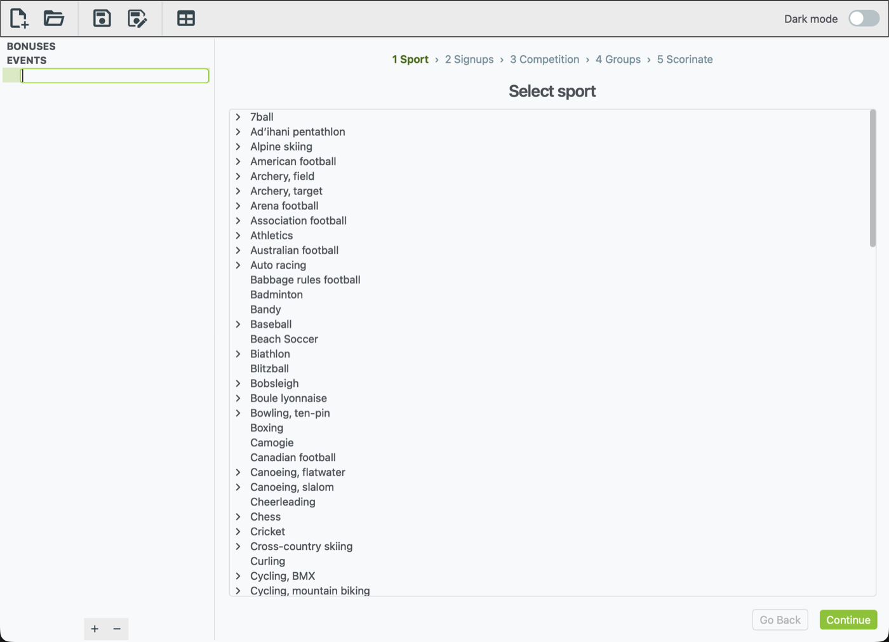
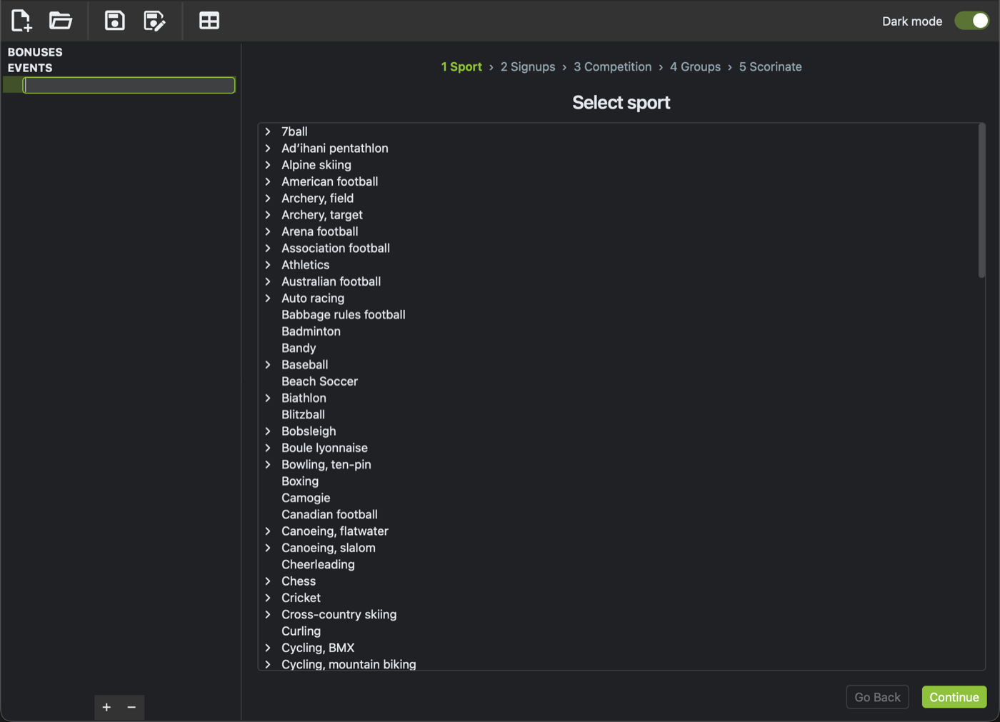
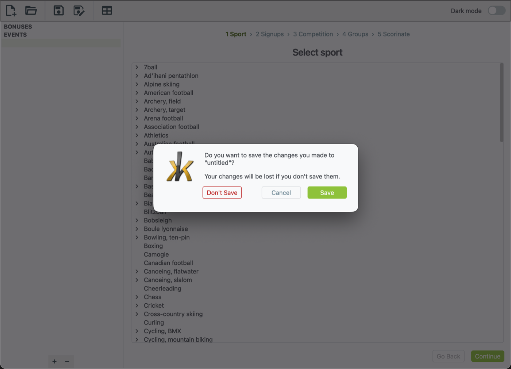

# xkoranate-CE

xkoranate-CE is the sports "scorinator" used by **NS Sports**, the sports
roleplay forum for [NationStates](https://www.nationstates.net/). You describe
who's competing and how, and xkoranate simulates a result — a match score, a
race time, a placement — that you can post to the forum.

This is a Python/PySide6 rewrite of the original Qt4/C++ xkoranate-CE by
Commerce Heights (ThirdGeek), rebuilt to keep the same scorination math and
file formats while running on current macOS, Windows, and Linux.

- **[Getting started](getting-started.md)** — install xkoranate and take the tour
- **[Building an event](building-an-event.md)** — the 5-step event wizard, from picking a sport to posting results
- **[Table generator](table-generator.md)** — build league standings from match results
- **[RP bonuses](rp-bonuses.md)** — configure per-nation roleplay bonuses

## What xkoranate simulates

Over a hundred disciplines across sixty-plus sports are supported out of the
box: head-to-head matches (football codes, racket sports, combat sports),
mass-start races (athletics, cycling, skiing), multi-run events (gymnastics,
diving), and precision sports (shooting, archery). Each sport comes with its
own scoring engine under the hood — you just pick the sport, xkoranate takes
care of the rest.

## Screenshots

| Light mode | Dark mode |
|---|---|
|  |  |

xkoranate warns before discarding unsaved changes, same as the original:

## Getting help

- Something not working? [File a bug report](https://github.com/lukeplatts/xkoranate-ce-python/issues/new?template=bug_report.yml).
- Missing a feature? [Request it](https://github.com/lukeplatts/xkoranate-ce-python/issues/new?template=feature_request.yml) or check the [roadmap](https://github.com/lukeplatts/xkoranate-ce-python/blob/main/ROADMAP.md) for what's already planned.
